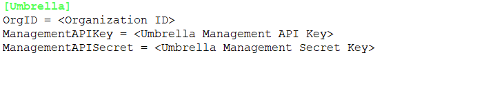
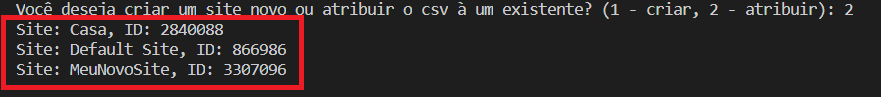
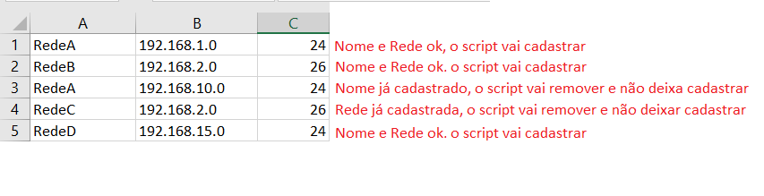
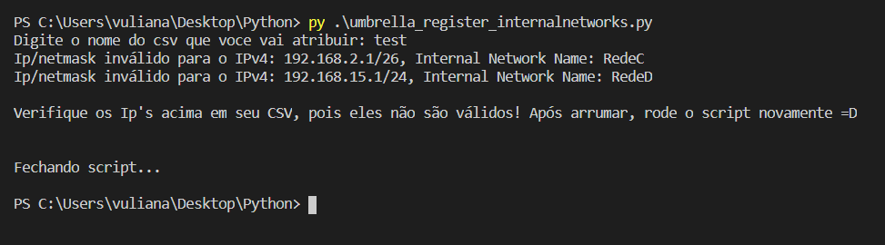
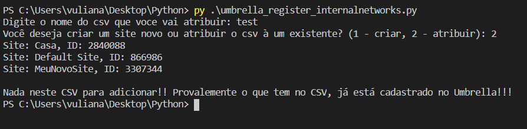
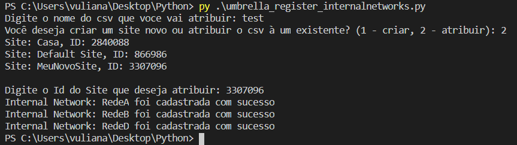
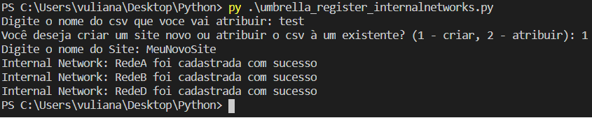
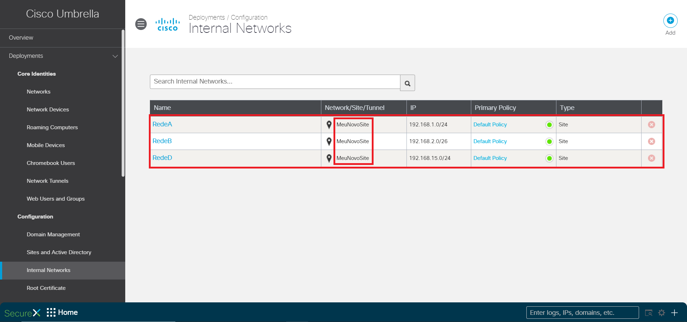
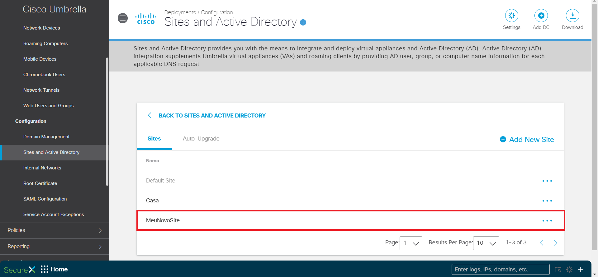

# Cisco Umbrella Internal Network Register

Este repositório contém um script em Python que cria Internal Networks no Umbrella a partir de um CSV, facilitando para cadastro de redes em massa.

API key e API secret do <a href="https://docs.umbrella.com/umbrella-api/docs/authentication-and-errors">Cisco Umbrella Management API</a> também é necessário para execução do script.

O ID da sua Organização do Umbrella também é necessário para execução do script! Use <a href = "https://docs.umbrella.com/deployment-umbrella/docs/find-your-organization-id" target="_blank">esta documentação</a> para saber como obter seu Organization ID.

Se não tiver as bibliotecas Python necessárias configuradas, receberá um erro ao executar o script. Você precisará instalar o arquivo "requirements.txt": (certifique-se de que está no mesmo diretório que os arquivos clonados do git): 
<b> pip install -r requirements.txt</b> 
<b> pip3 install -r requirements.txt</b> (Para Python 3.X)  

# Arquivo de configuração, modificar com seus dados e credenciais antes de rodar o script
   

# Como funciona ??

• O script vai exigir através de prompts que você indique o arquivo CSV que vai ser usado para o cadastro. Caso não encontre ele encerra. (Não é necessário colocar extensão, o script faz isso automáticamente)

• Após informar o CSV, e caso ele exista, o script vai te dar duas opções:  
1. Criar um novo Site, e a partir do Site criado, cadastrar as Internals Networks do CSV atribuídas à esse novo site criado

2. Registrar as Internal Networks à um site existente, o scritp vai printar uma lista de sites existentes no Umbrella e para essa opção você deve usar o SiteId futuramente.
<
3. O CSV deve ser preenchido da seguinte forma para que o script funcione corretamente 
<b> SEMPRE: NOME,IP,PREFIXO</b>
  

# Features
• O script trabalha de forma totalmente inteligente, faz verificações básicas e avançadas, e toma as decisões corretamente, entre elas: 
1. Verifica se os Ip's informados no CSV são válidos. Deve ser um Ip de rede. O script informa quais são os Ip's incorretos no CSV para facilitar na correçao do usuário.
2. Verifica se um Site já esta cadastrado no Umbrella, caso a opção escolhida pelo usuário serja de criar um novo Site. Isso porque no Umbrella não pode existir Sites com o mesmo nome
3. Remove do CSV qualquer tipo de informação que esteja exatamente duplicada
4. Remove do CSV nomes, ip/prefix que sejam iguais! Isso porque no Umbrella, nome e Ip's devem ser únicos, então o script faz isso automáticamente pra você caso tenha algo duplicado no CSV
5. Compara com o que já está cadastrado no Umbrella, caso já esteja, o script automáticamente remove esses dados e não os envia para cadastro, só envia realmente o que não estiver cadastrado no Umbrella. <b>Com isso facilita muito a vida do usuário!!</b>

# Imagens funcionamento do script
 
 
<b> Opção de atribuir<b>
 
<b> Opção de criar novo Site<b>
 
<b> Dashboard Umbrella mostrando cadastrado!
 
 
