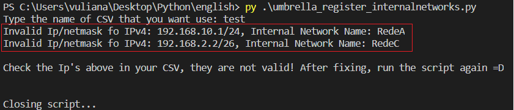

# Cisco Umbrella Internal Network Register

This repo contains a Python script that creates Internal Networks in Umbrella using a CSV file, making it easier to register mass networks.

API key and API secret of <a href="https://docs.umbrella.com/umbrella-api/docs/authentication-and-errors">Cisco Umbrella Management API</a> is also required.

Umbrella Organization ID is also required to use this script! Use <a href = "https://docs.umbrella.com/deployment-umbrella/docs/find-your-organization-id" target="_blank">esta documentação</a> to find out how to obtain your Organization ID.

If you do not have the required Python libraries configured, you will receive an error when running the script. You will need to install the "requirements.txt" file: (make sure it is in the same directory as the cloned git files): 
<b> pip install -r requirements.txt</b> 

# Config file, modify with your data and credentials before running the script
   

# How it works ??
• The script will require prompts to indicate the CSV file that will be used for registration. If not, it closes. (There is no need to add an extension for the CSV file, the script does it automatically) 
   
• After informing the CSV, and if it exists, the script will give you two options:  
    1. Create a new Site, and from the created Site, register the Internals Networks and assing to this new created Site 
     
    2. Register the Internal Networks ans assigns to a existing site, the scritp will print a list of existing Sites on Umbrella, and for that option you will use the SiteId in nexts steps 
     
    3. O CSV deve ser preenchido da seguinte forma para que o script funcione corretamente 
<b> ALWAYS: NAME,IP,PREFIX</b>
  

# Features
•  The script works in a totally intelligent way, does basic and advanced checks, and makes decisions correctly, including: 
1. Checks if the Ip's informed in the CSV are valid. It must be a Network Ip. The script tells you which IP's are incorrect in the CSV to facilitate user correction
2. Checks if a Site is already registered in Umbrella, if the option chosen by the user is to create a new Site. That's because Umbrella cannot have Sites with the same name
3. It will remove from the CSV any information that is exactly duplicated
4. It will remove from the CSV names and Networks that are the same! That's because in Umbrella, name and networs must be unique, so the script does this automatically for you if you have something duplicated in CSV
5. It will compare with what is already registered in Umbrella, and if is are already registered, the script automatically removes this data and does not send it for registration! The script will send only what is not registered in Umbrella. <b>This makes the user’s life much easier =D</b>

# Images of how script works
 
 
<b> If the user chooses the option to assign to an existing Site<b> 
 
<b> If the user chooses the option to create a new Site<b>
 
<b> Showing on Umbrella Dashboard !
 
 
